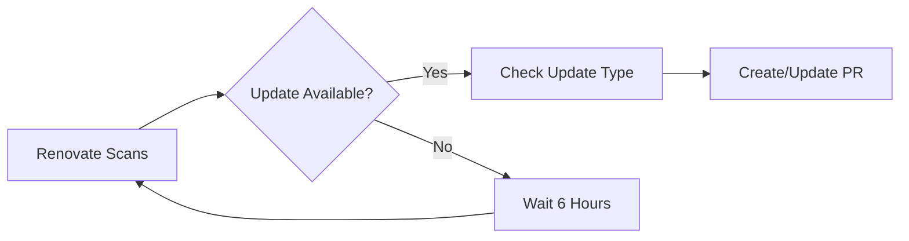
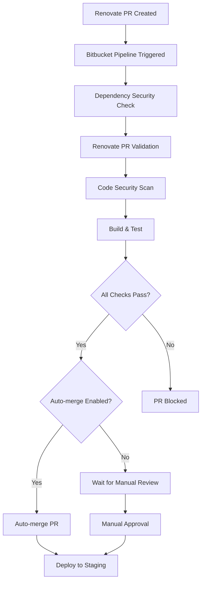

# Automated Dependency Updates with Renovate Bot

## Overview

This document describes the automated dependency update system implemented for the Todo Application using Renovate Bot. The system provides automated dependency management, security vulnerability detection, and seamless integration with our Bitbucket Pipelines CI/CD workflow.

## 🤖 Renovate Bot Configuration

### Core Features

- **Automated Dependency Updates**: Continuous monitoring and updating of npm packages
- **Security-First Approach**: Immediate processing of security vulnerabilities
- **Smart Grouping**: Related dependencies updated together to reduce PR noise
- **Auto-Merge Capabilities**: Safe automatic merging of patch and minor updates
- **Comprehensive Testing**: All updates validated through CI/CD pipeline

### Configuration Summary

| Feature              | Configuration          | Purpose                                     |
| -------------------- | ---------------------- | ------------------------------------------- |
| **Schedule**         | Monday 6am PT          | Weekly batch updates to minimize disruption |
| **Auto-merge**       | Patch & Minor updates  | Automatic deployment of safe updates        |
| **Security Updates** | Immediate processing   | Zero-delay security vulnerability fixes     |
| **Major Updates**    | Manual review required | Breaking changes need human oversight       |
| **Grouped Updates**  | AWS SDK, React, ESLint | Logical grouping reduces review overhead    |

## 📋 Update Categories

### 1. Security Updates (Highest Priority)

- **Trigger**: Any security vulnerability detected
- **Schedule**: Immediate (at any time)
- **Auto-merge**: ✅ Yes (after CI passes)
- **Labels**: `security`, `dependencies`
- **Stability Days**: 0 (immediate)

### 2. Patch & Minor Updates

- **Trigger**: Non-breaking version updates
- **Schedule**: Monday 6am PT
- **Auto-merge**: ✅ Yes (after CI passes)
- **Stability Days**: 3 days
- **Examples**: `1.2.3 → 1.2.4` or `1.2.3 → 1.3.0`

### 3. Major Updates

- **Trigger**: Breaking version changes
- **Schedule**: Monday 6am PT
- **Auto-merge**: ❌ No (manual review required)
- **Labels**: `major-update`, `dependencies`
- **Review**: Required via CODEOWNERS
- **Examples**: `1.2.3 → 2.0.0`

### 4. Grouped Updates

#### AWS SDK Updates

- **Packages**: `@aws-sdk/*`, `aws-*`
- **Rationale**: AWS packages often have interdependencies
- **Schedule**: Monday 6am PT
- **Auto-merge**: ❌ No (requires testing)

#### React Ecosystem

- **Packages**: `react`, `@types/react*`, `@vitejs/*`
- **Rationale**: React updates may affect component behavior
- **Schedule**: Monday 6am PT
- **Auto-merge**: ❌ No (requires testing)

#### Linting & Formatting

- **Packages**: `eslint*`, `prettier`, `@typescript-eslint/*`
- **Rationale**: Low-risk developer tooling updates
- **Auto-merge**: ✅ Yes (after CI passes)

## 🔄 Automated Workflow

### 1. Detection Phase



### 2. PR Creation

- **Branch Naming**: `renovate/{package-name}-{version}`
- **Commit Format**: `chore(deps): update {package} to {version}`
- **PR Title**: Descriptive with package and version info
- **PR Body**: Includes changelog links and compatibility notes

### 3. CI/CD Integration



## 🔒 Security Integration

### Vulnerability Detection

- **npm audit**: Dependency vulnerability scanning
- **Snyk**: Advanced security analysis (if token configured)
- **Trivy/Grype**: Container image security scanning
- **Semgrep**: Static application security testing

### Security Workflow

1. **Immediate Response**: Security updates bypass normal scheduling
2. **Priority Processing**: Security PRs get highest priority in queue
3. **Automated Validation**: Full security scan pipeline execution
4. **Fast-Track Deployment**: Auto-merge enabled for security fixes

## 📊 Monitoring & Dashboards

### Dependency Dashboard

- **Location**: Created as Bitbucket issue
- **Title**: "🤖 Dependency Updates Dashboard"
- **Content**:
  - Pending updates overview
  - Failed update attempts
  - Security vulnerability status
  - Configuration health check

### Pipeline Integration

- **Custom Pipeline**: `dependency-update-check`
- **Artifacts**: Dependency reports and security summaries
- **Monitoring**: CloudWatch integration for update success/failure rates

## 🛠 Operational Procedures

### Daily Operations

1. **Review Dashboard**: Check dependency update status
2. **Monitor Security Alerts**: Immediate action on vulnerabilities
3. **Validate Auto-merges**: Ensure successful deployments

### Weekly Operations

1. **Review Major Updates**: Manual approval for breaking changes
2. **Update Renovate Config**: Adjust rules based on experience
3. **Security Report Review**: Analyze security scanning results

### Monthly Operations

1. **Configuration Audit**: Review and optimize Renovate settings
2. **Performance Analysis**: Update success rates and deployment metrics
3. **Team Training**: Share learnings and best practices

## 🚨 Incident Response

### Failed Dependency Update

1. **Immediate**: Check pipeline logs for failure reason
2. **Analysis**: Determine if update breaks functionality
3. **Action**: Create manual PR with fix or block problematic update
4. **Prevention**: Update Renovate config to avoid similar issues

### Security Vulnerability Alert

1. **Immediate**: Verify if vulnerability affects our usage
2. **Priority**: Create emergency update if critical
3. **Communication**: Notify team of security status
4. **Documentation**: Record incident and resolution

## 📁 Configuration Files

### Core Configuration

- **`renovate.json`**: Main Renovate Bot configuration
- **`.bitbucket/CODEOWNERS`**: Review assignment for updates
- **`bitbucket-pipelines.yml`**: CI/CD integration

### Workspace Package Files

- **`package.json`**: Root workspace configuration
- **`frontend/package.json`**: Frontend dependencies
- **`backend/package.json`**: Backend API dependencies
- **`infrastructure/package.json`**: Infrastructure dependencies

## 🔧 Customization Guide

### Adding New Package Rules

```json
{
  "packageRules": [
    {
      "description": "Custom rule for specific packages",
      "matchPackagePatterns": ["your-package-*"],
      "groupName": "your package group",
      "schedule": ["before 6am on monday"],
      "automerge": false
    }
  ]
}
```

### Modifying Auto-merge Behavior

```json
{
  "packageRules": [
    {
      "matchDepTypes": ["dependencies"],
      "matchUpdateTypes": ["patch"],
      "automerge": true,
      "automergeType": "pr",
      "automergeStrategy": "squash"
    }
  ]
}
```

## 📚 Resources

### Documentation

- [Renovate Documentation](https://docs.renovatebot.com/)
- [Bitbucket Pipelines Guide](https://bitbucket.org/product/features/pipelines)
- [npm Security Best Practices](https://docs.npmjs.com/security)

### Tools

- [Renovate Config Validator](https://app.renovatebot.com/config-validator)
- [npm-check-updates](https://www.npmjs.com/package/npm-check-updates)
- [npm audit](https://docs.npmjs.com/cli/v8/commands/npm-audit)

### Support

- **Internal**: Check project documentation in `/docs`
- **Renovate**: GitHub issues and community support
- **Bitbucket**: Official support channels

## 🎯 Success Metrics

### Automation Efficiency

- **Update Success Rate**: >95% successful auto-updates
- **Security Response Time**: <4 hours for critical vulnerabilities
- **Manual Review Time**: <24 hours for major updates

### Quality Metrics

- **Deployment Success**: >99% successful deployments post-update
- **Rollback Rate**: <1% of dependency updates require rollback
- **Security Coverage**: 100% vulnerability detection and patching

---

**Last Updated**: {current_date}
**Maintained By**: DevOps Team
**Review Cycle**: Monthly
