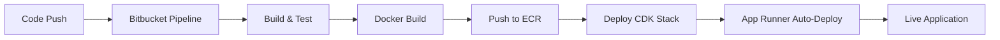

# 🚀 Backend Containerization & CI/CD Setup Summary

## ✅ What We've Accomplished

### 1. **Backend Containerization**

- ✅ Created optimized multi-stage `Dockerfile` for the Fastify API
- ✅ Added `.dockerignore` for efficient builds
- ✅ Fixed server binding to work in containers (`0.0.0.0` instead of `localhost`)
- ✅ Added TypeScript to devDependencies for Docker builds
- ✅ Created Docker-related npm scripts in `package.json`
- ✅ Successfully tested Docker image build and container execution

### 2. **AWS Infrastructure (CDK)**

- ✅ Added **ECR Repository** for storing Docker images
- ✅ Added **App Runner Service** for serverless container deployment
- ✅ Configured proper IAM roles and permissions
- ✅ Set up environment variables for the containerized app
- ✅ Added CloudFormation outputs for ECR and App Runner resources
- ✅ Verified CDK stack compiles successfully

### 3. **Bitbucket CI/CD Pipeline**

- ✅ Created `bitbucket-pipelines.yml` with complete workflow
- ✅ Configured multi-stage pipeline:
  - Build and test backend
  - Build and push Docker image to ECR
  - Deploy infrastructure updates
  - Trigger App Runner deployment
- ✅ Set up different workflows for branches, PRs, and tags
- ✅ Created comprehensive documentation with setup instructions

## 📁 Files Created/Modified

### Backend Files

```
backend/
├── Dockerfile                 # Multi-stage Docker build
├── .dockerignore             # Docker build context optimization
├── env.docker.example        # Environment variables template
├── package.json              # Added Docker scripts & TypeScript
├── scripts/
│   └── init-dynamodb.js      # DynamoDB table initialization
├── src/
│   └── server.ts             # Fixed host binding (0.0.0.0)
└── README-Docker.md          # Docker documentation
```

### Infrastructure Files

```
infrastructure/
└── lib/
    └── todo-app-stack.ts     # Added ECR + App Runner resources
```

### CI/CD Files

```
├── bitbucket-pipelines.yml   # Bitbucket CI/CD pipeline
└── docs/
    ├── bitbucket-pipeline-setup.md  # Detailed setup guide
    └── deployment-summary.md        # This summary
```

## 🔧 Key Features

### Docker Container

- **Multi-stage build** for optimized production images
- **Security**: Non-root user, proper signal handling
- **Health checks**: Built-in health monitoring
- **Environment**: Configurable via environment variables

### App Runner Service

- **Serverless**: No infrastructure management required
- **Auto-scaling**: Scales based on traffic
- **Auto-deployment**: Triggers on new ECR images
- **Integrated**: Connected to DynamoDB and Cognito

### CI/CD Pipeline

- **Automated testing**: Runs tests and linting
- **Docker builds**: Builds and pushes to ECR
- **Infrastructure deployment**: Updates AWS resources
- **Multi-environment**: Support for dev/staging/prod

## 🚀 Deployment Workflow



## 📋 Next Steps

### 1. **Deploy Infrastructure**

```bash
cd infrastructure
npm install
npm run build
npx cdk deploy
```

### 2. **Configure Bitbucket**

1. Add environment variables to Bitbucket repository
2. Enable Pipelines in repository settings
3. Push code to trigger first deployment

### 3. **Get Deployment URLs**

After deployment, retrieve the App Runner service URL:

```bash
aws cloudformation describe-stacks \
  --stack-name TodoAppStack \
  --query 'Stacks[0].Outputs[?OutputKey==`AppRunnerServiceUrl`].OutputValue' \
  --output text
```

## 🔍 Environment Variables Required

### For Bitbucket Pipeline

```bash
AWS_ACCESS_KEY_ID=AKIA...
AWS_SECRET_ACCESS_KEY=...
AWS_DEFAULT_REGION=ap-southeast-2
ECR_REPOSITORY_URI=123456789012.dkr.ecr.ap-southeast-2.amazonaws.com/todo-app-dev-backend-api
APP_RUNNER_SERVICE_ARN=arn:aws:apprunner:ap-southeast-2:123456789012:service/...
```

### For App Runner Service (Auto-configured by CDK)

```bash
NODE_ENV=development
AWS_REGION=ap-southeast-2
DYNAMODB_TABLE_NAME=todo-app-dev-todos
COGNITO_USER_POOL_ID=ap-southeast-2_XXXXXXXXX
COGNITO_CLIENT_ID=your-cognito-client-id
```

## 🎯 Benefits Achieved

1. **Scalability**: App Runner automatically scales based on demand
2. **Reliability**: Health checks and auto-recovery
3. **Security**: IAM roles, non-root containers, ECR image scanning
4. **Efficiency**: Multi-stage builds, optimized images
5. **Automation**: Complete CI/CD from code to production
6. **Cost-effective**: Pay only for what you use with App Runner
7. **Monitoring**: Built-in CloudWatch integration

## 🚨 Important Notes

- **First Deployment**: Deploy infrastructure first to create ECR repository
- **Image Tags**: Pipeline uses commit SHA for versioning
- **Auto-deployment**: App Runner automatically deploys new images
- **Permissions**: Ensure Bitbucket has proper AWS IAM permissions
- **Region**: Currently configured for Sydney (ap-southeast-2)

Your backend Fastify API is now fully containerized and ready for production deployment with automated CI/CD! 🎉
