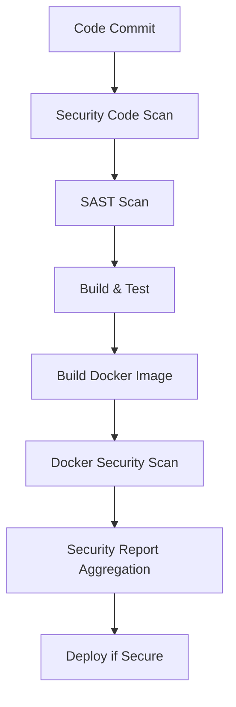

# Security Scanning Implementation Guide

## Overview

This document describes the comprehensive security scanning implementation added to the CI/CD pipeline for the Todo Application. The solution includes multiple layers of security scanning to identify vulnerabilities early in the development lifecycle.

## Security Scanning Components

### 1. Code Security Scan

**Purpose**: Identifies vulnerabilities in application dependencies and code

**Tools Used**:

- **npm audit**: Built-in Node.js dependency vulnerability scanner
- **Snyk**: Commercial security platform for dependency and code scanning
- **audit-ci**: CI-friendly npm audit wrapper

**What it scans**:

- Node.js package dependencies
- Known vulnerabilities in npm packages
- License compliance issues
- Outdated packages with security patches

**Configuration**:

```yaml
- step: &security-code-scan
    name: Code Security Scan
    image: node:22-alpine
    script:
      - npm install -g npm-audit-ci-wrapper audit-ci snyk
      - cd backend && npm audit --audit-level=high
      - cd ../frontend && npm audit --audit-level=high
      # Snyk scan (requires SNYK_TOKEN environment variable)
      - snyk auth $SNYK_TOKEN && snyk test --severity-threshold=high
```

### 2. Static Application Security Testing (SAST)

**Purpose**: Analyzes source code for security vulnerabilities without executing the code

**Tool Used**: **Semgrep**

- Industry-standard SAST tool
- Supports multiple programming languages
- Extensive rule database for security patterns
- SARIF output format for integration with security dashboards

**What it scans**:

- SQL injection vulnerabilities
- Cross-site scripting (XSS) patterns
- Authentication bypass issues
- Insecure cryptographic practices
- Hard-coded credentials
- Path traversal vulnerabilities

**Configuration**:

```yaml
- step: &semgrep-sast-scan
    name: SAST Scan with Semgrep
    image: returntocorp/semgrep:latest
    script:
      - semgrep --config=auto --json --output=semgrep-results.json .
      - semgrep --config=auto --sarif --output=semgrep-results.sarif .
```

### 3. Docker Image Security Scan

**Purpose**: Identifies vulnerabilities in Docker container images

**Tools Used**:

- **Trivy**: Comprehensive vulnerability scanner for containers
- **Grype**: Anchore's open-source vulnerability scanner
- **Docker Scout**: Docker's native security scanning (optional)

**What it scans**:

- Base image vulnerabilities
- Package vulnerabilities in container layers
- Configuration issues
- Secrets exposed in images
- License compliance

**Configuration**:

```yaml
- step: &docker-security-scan
    name: Docker Image Security Scan
    script:
      # Multiple scanners for comprehensive coverage
      - trivy image --severity HIGH,CRITICAL $ECR_REPOSITORY_URI:$BITBUCKET_COMMIT
      - grype $ECR_REPOSITORY_URI:$BITBUCKET_COMMIT
      - docker scout cves $ECR_REPOSITORY_URI:$BITBUCKET_COMMIT
```

## Pipeline Integration

### Security-First Approach

The security scans are integrated early in the pipeline:

1. **Pre-Build Security**: Code and SAST scanning before building
2. **Post-Build Security**: Docker image scanning after container build
3. **Deployment Gates**: Security results can block deployments if critical issues are found

### Pipeline Flow



### Branch-Specific Behavior

| Branch Type       | Security Scans Applied          |
| ----------------- | ------------------------------- |
| **Pull Requests** | Code Security + SAST only       |
| **develop**       | Full security scanning pipeline |
| **main**          | Full security scanning pipeline |
| **tags (v\*)**    | Full security scanning pipeline |

## Required Environment Variables

### Core Variables

```bash
# AWS Configuration (already existing)
AWS_ACCESS_KEY_ID=your_access_key
AWS_SECRET_ACCESS_KEY=your_secret_key
AWS_DEFAULT_REGION=us-east-1
ECR_REPOSITORY_URI=your_ecr_repo_uri
```

### Security Scanning Variables

```bash
# Snyk (Optional - for enhanced dependency scanning)
SNYK_TOKEN=your_snyk_token

# Docker Scout (Optional - for Docker native scanning)
DOCKER_SCOUT_HUB_TOKEN=your_docker_hub_token
DOCKER_SCOUT_HUB_USER=your_docker_hub_username
```

## Security Scan Results

### Output Formats

All security scanners produce results in multiple formats:

1. **JSON**: Machine-readable for automation and integration
2. **SARIF**: Security Analysis Results Interchange Format for security dashboards
3. **Text**: Human-readable console output

### Artifacts Generated

| Artifact                | Description                        | Use Case                         |
| ----------------------- | ---------------------------------- | -------------------------------- |
| `semgrep-results.sarif` | SAST findings in SARIF format      | GitHub Security, IDE integration |
| `trivy-results.json`    | Container vulnerabilities          | Automation, reporting            |
| `grype-results.sarif`   | Container vulnerabilities in SARIF | Security dashboards              |
| `security-summary.md`   | Human-readable summary             | Team communication               |

### Viewing Results

#### In Bitbucket Pipelines

1. Navigate to your pipeline execution
2. Click on the security scan step
3. View console output for immediate results
4. Download artifacts for detailed analysis

#### In Security Dashboards

1. Upload SARIF files to GitHub Security tab
2. Integrate with Snyk dashboard (if using Snyk)
3. Use Trivy output for vulnerability tracking

## Security Policies

### Severity Thresholds

| Scanner   | Threshold     | Action        |
| --------- | ------------- | ------------- |
| npm audit | HIGH          | Fail build    |
| Snyk      | HIGH          | Fail build    |
| Semgrep   | ANY           | Report only\* |
| Trivy     | HIGH,CRITICAL | Report only\* |
| Grype     | ANY           | Report only\* |

\*Can be configured to fail builds based on findings

### Vulnerability Response

1. **Critical/High Vulnerabilities**: Immediate review required
2. **Medium Vulnerabilities**: Review within 7 days
3. **Low Vulnerabilities**: Review during next sprint
4. **False Positives**: Document and suppress appropriately

## Configuration Management

### Customizing Scan Rules

#### Semgrep Custom Rules

Create `.semgrep.yml` in project root:

```yaml
rules:
  - id: custom-security-rule
    pattern: |
      password = "$VALUE"
    message: 'Hard-coded password detected'
    severity: ERROR
    languages: [javascript, typescript]
```

#### Trivy Configuration

Create `.trivyignore` for suppressing known false positives:

```
# Suppress specific CVE
CVE-2021-12345

# Suppress by package
package-name
```

### Scanner Configuration Files

| Scanner   | Config File    | Purpose                    |
| --------- | -------------- | -------------------------- |
| Semgrep   | `.semgrep.yml` | Custom rules, suppressions |
| Trivy     | `.trivyignore` | Vulnerability suppressions |
| npm audit | `.auditignore` | Advisory suppressions      |

## Troubleshooting

### Common Issues

#### 1. Scanner Installation Failures

```bash
# Solution: Add retry logic and fallback mirrors
curl -sfL https://raw.githubusercontent.com/aquasecurity/trivy/main/contrib/install.sh | sh -s -- -b /usr/local/bin
```

#### 2. Network Timeouts

```bash
# Solution: Increase timeout values
trivy image --timeout 10m $IMAGE_NAME
```

#### 3. Large Image Scan Times

```bash
# Solution: Optimize Docker images
FROM node:22-alpine  # Use minimal base images
RUN apk add --no-cache dumb-init  # Only install necessary packages
```

### Performance Optimization

1. **Parallel Scanning**: Run code and SAST scans in parallel
2. **Caching**: Cache scanner databases when possible
3. **Selective Scanning**: Skip scans for documentation-only changes

## Security Monitoring Integration

### CloudWatch Integration

```bash
# Send security metrics to CloudWatch
aws cloudwatch put-metric-data \
  --namespace "Security/Pipeline" \
  --metric-data MetricName=VulnerabilitiesFound,Value=$VULN_COUNT
```

### Slack/Teams Notifications

```bash
# Send security alerts to team channels
curl -X POST -H 'Content-type: application/json' \
  --data '{"text":"Security scan completed with '$VULN_COUNT' vulnerabilities"}' \
  $SLACK_WEBHOOK_URL
```

## Best Practices

### 1. Regular Updates

- Update scanner tools monthly
- Refresh vulnerability databases weekly
- Review and update suppression lists quarterly

### 2. Developer Training

- Educate team on common vulnerability patterns
- Provide secure coding guidelines
- Regular security awareness sessions

### 3. Incident Response

- Document security incident procedures
- Maintain emergency contact list
- Practice incident response scenarios

### 4. Compliance

- Map scans to compliance requirements (SOC2, GDPR, etc.)
- Generate compliance reports from scan results
- Maintain audit trails for security decisions

## Integration with External Tools

### GitHub Security

```bash
# Upload SARIF to GitHub
curl -X POST \
  -H "Authorization: token $GITHUB_TOKEN" \
  -H "Content-Type: application/json" \
  "https://api.github.com/repos/$OWNER/$REPO/code-scanning/sarifs" \
  -d @semgrep-results.sarif
```

### Jira Integration

```bash
# Create Jira tickets for high-severity findings
curl -X POST \
  -H "Content-Type: application/json" \
  -d '{"fields":{"project":{"key":"SEC"},"summary":"Security Vulnerability Found"}}' \
  $JIRA_API_URL
```

## Future Enhancements

### Planned Improvements

1. **Dynamic Application Security Testing (DAST)**: Add runtime security testing
2. **Infrastructure as Code Scanning**: Scan CDK/CloudFormation templates
3. **Secrets Scanning**: Add dedicated secrets detection tools
4. **License Compliance**: Enhanced license scanning and reporting
5. **Security Metrics Dashboard**: Real-time security posture visibility

### Advanced Features

1. **AI-Powered Analysis**: Machine learning for false positive reduction
2. **Continuous Monitoring**: Runtime security monitoring integration
3. **Threat Intelligence**: Integration with threat intelligence feeds
4. **Compliance Automation**: Automated compliance report generation

This comprehensive security scanning implementation provides multiple layers of protection and ensures that security is integrated throughout the development lifecycle.
